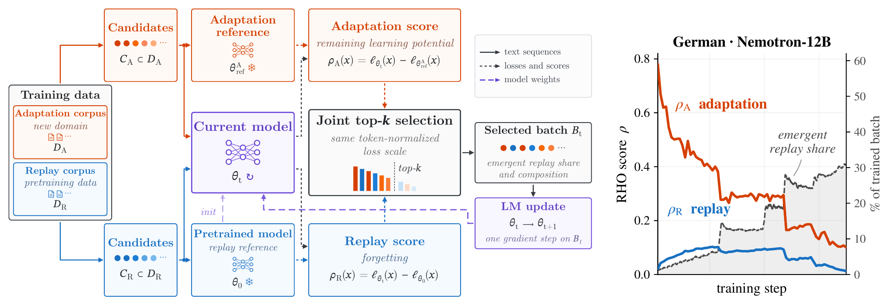

# Replay on Demand (RoD)

Code for the paper *Replay on Demand: An Emergent Curriculum for Balancing Adaptation and
Forgetting in Continued Pretraining* (under review).

## Overview



*Left: RoD scores adaptation candidates by their remaining learning potential and replay
candidates by their forgetting, and lets both compete for a shared training budget through
joint top-k selection. Right: the replay share emerges during training, increasing as forgetting
emerges and adaptation learning potential decreases (German · Nemotron-12B).*

Continued pretraining (CPT) adapts language models to new domains and knowledge, but often at
the cost of forgetting previously acquired capabilities. Replay of pretraining data mitigates
this trade-off, but fixed replay mixtures allocate training independently of the model's actual
retention needs, even though forgetting is heterogeneous across capabilities and data sources
and retention needs evolve during training.

*Replay on Demand* (RoD) instead derives the replay allocation from the model's learning
dynamics. It builds on reducible-loss data selection (RHO; Mindermann et al., 2022) and scores
every candidate against a reference model chosen by its source. Let θ<sub>0</sub> be the
pretrained model, θ<sub>t</sub> the model after t updates, D<sub>A</sub> the adaptation
distribution and D<sub>R</sub> the pretraining distribution, and ℓ<sub>θ</sub>(x) the
token-normalized language-modeling loss of a sequence x. At every step, RoD draws candidate sets
C<sub>A</sub> ⊂ D<sub>A</sub> and C<sub>R</sub> ⊂ D<sub>R</sub> and scores them by

- **remaining learning potential** for adaptation candidates,
  ρ<sub>A</sub>(x; θ<sub>t</sub>) = ℓ<sub>θ<sub>t</sub></sub>(x) − ℓ<sub>θ<sub>ref</sub><sup>A</sup></sub>(x),
  where the adaptation reference θ<sub>ref</sub><sup>A</sup> is the pretrained model trained on
  D<sub>A</sub> alone;
- **forgetting** for replay candidates,
  ρ<sub>R</sub>(x; θ<sub>t</sub>) = ℓ<sub>θ<sub>t</sub></sub>(x) − ℓ<sub>θ<sub>0</sub></sub>(x),
  which is ≈ 0 while x is retained and positive once it degrades.

Both scores are differences on the same loss scale, so RoD ranks them jointly and trains on the
k highest-scoring candidates, B<sub>t</sub> = TopK<sub>x ∈ C<sub>A</sub> ∪ C<sub>R</sub></sub>
ρ(x; θ<sub>t</sub>), with the standard language-modeling objective. There is no per-source
quota: how much and what to replay follows from the model's evolving learning and forgetting
state. The only hyperparameter of RoD is the candidate multiplier m, with
|C<sub>A</sub>| + |C<sub>R</sub>| = mk (m = 2 in the paper).

The implementation is a thin layer on top of [NVIDIA NeMo-RL](https://github.com/NVIDIA-NeMo/RL)
v0.6.0 (Megatron backend): it reuses NeMo-RL's SFT trainer, policy workers and data utilities,
and replaces the training loop with a *score → select → train* step.

## Repository layout

```
src/sitecustomize.py          installs rod.compat in every process (driver, Ray workers, converter)
src/rod/
  run_rod.py                  training entry point (RoD, and plain CPT baselines)
  run_precompute.py           reference-loss precompute (one pass per reference model)
  patches/
    rod_sft_train.py          the RoD training loop: score → select → train, selection metrics
    rod_score_pass.py         per-step scoring pass: current-model losses on the pool, ρ = ℓ_θt − ℓ_ref
    rod_loss.py               shared per-sequence loss ℓ(x), corpus tags, distributed helpers
    rod_scoring_loss.py       eval-only loss fn used for validation (per-origin losses, ρ metrics)
    rod_validate.py           validation: sequence-weighted val loss + per-origin val losses
    rod_collate.py            threads ref_loss / origin_tag / origin / content_hash into batches
  data/
    rod_pretrain_blocks.py    corpus ingestion: tokenize + pack 4096-token blocks, holdout split,
                              reference-loss cache join, per-run train/val mixer
    rod_dataset.py            dataset preparation + NeMo-RL preprocessor for packed blocks
    stage_replay_pool.py      selective download of the replay pool (Nemotron pretraining data)
  configs/                    config schema (NeMo-RL master config + the `rod` block)
  compat.py                   Qwen3.5 shim: sets the vision config's missing deepstack_visual_indexes
  utils/
    convert_mcore_to_hf.py    Megatron checkpoint → Hugging Face format
    merge_models.py           model-merging baseline: θ_merge = (1 − λ)·θ_0 + λ·θ_A
configs/
  default.yaml                base config (NeMo-RL SFT config + the `rod` and `data_mixer` blocks)
  experiments/                representative configs of the paper runs, and a table of all runs
slurm/                        Apptainer + SLURM launch scripts (see "Running the pipeline")
tests/                        CPU-only unit tests (pytest)
```

### How the code maps to the method

| Step | Where |
|---|---|
| Pack both corpora into 4096-token blocks, one source per block; deterministic content hash; 1% per-source holdout | `rod_pretrain_blocks.build_blocks_corpus` |
| Balanced candidate stream: subsample the replay corpus once so both sources occur equally often (\|C<sub>A</sub>\| = \|C<sub>R</sub>\| = mk/2 in expectation) | `rod_pretrain_blocks.balance_replay` (`--balance-replay`) or `data_mixer.replay_share` |
| Token-normalized sequence loss ℓ<sub>θ</sub>(x), shared by precompute, scoring and validation | `rod_loss.compute_target_loss` |
| Precompute the reference losses (θ<sub>ref</sub><sup>A</sup> on adaptation blocks, θ<sub>0</sub> on replay blocks), cached by content hash | `run_precompute.py` |
| Forward-only scoring of the candidate pool with θ<sub>t</sub>, ρ(x; θ<sub>t</sub>) = ℓ<sub>θ<sub>t</sub></sub>(x) − ℓ<sub>ref</sub>(x) | `rod_score_pass.policy_score` |
| Joint top-k selection B<sub>t</sub> (and the fixed-share ablation controls) | `rod_sft_train._select_candidates` |
| Update on B<sub>t</sub> with the unweighted language-modeling loss | `rod_sft_train` (`Policy.train` with `gbs = k`) |
| No-replay CPT (also the adaptation reference θ<sub>ref</sub><sup>A</sup>) and fixed-replay CPT baselines | `run_rod.py` with `rod.enable_selection=false` |
| Curriculum transfer: replay another run's selected-sample stream in order | `rod_pretrain_blocks.build_curriculum` (`rod.curriculum_trace_dirs`) |
| Model-merging baseline θ<sub>merge</sub> = (1 − λ)θ<sub>0</sub> + λθ<sub>A</sub> | `utils/merge_models.py` |

The candidate pool is one global batch of NeMo-RL's dataloader
(`policy.train_global_batch_size = m·k`), and `rod.top_k = k` sequences are trained per step.
In the paper, `k = 1024` sequences of 4096 tokens and `m = 2`, i.e. a pool of 2048.

## Requirements

- The public NeMo-RL container `nvcr.io/nvidia/nemo-rl:v0.6.0` (all heavy dependencies:
  PyTorch, Megatron-LM/Bridge, Ray), run through Apptainer.
- A SLURM cluster with GPU nodes. The scripts target one 8-GPU node with 80 GB GPUs, running
  the 12B model with pipeline parallelism 2 (`ROD_PP=2`).
- A Hugging Face token for the gated Nemotron datasets, and a Weights & Biases key (or
  `export WANDB_MODE=offline` to log locally only).

## Data

All corpora are public Hugging Face datasets. `slurm/stage_data.sh` stages them and packs them
into 4096-token blocks with the build arguments of the paper corpora, for one adaptation domain
at a time (`DOMAIN=legal` or `DOMAIN=german`):

| Role | Source | Origins (blocks are labelled by source) |
|---|---|---|
| Replay | Nemotron pretraining data (`nvidia/Nemotron-CC-v2`, `Nemotron-CC-Math-v1`, `Nemotron-Pretraining-Specialized-v1`, `-Code-v2`, `-SFT-v1`), a selective subsample listed in `STAGING_SPEC` of `stage_replay_pool.py` | one per staged source, each tagged with one of 4 capabilities (world knowledge, reasoning & math, multilingual, code); the Legal build groups them into these 4 (`--origin-map`) |
| Legal | `nvidia/Nemotron-Pretraining-Legal-v1` | one per subset |
| German | `coral-nlp/german-commons` (news, cultural, web, legal, political, scientific, economic), `HuggingFaceFW/finepdfs` (`deu_Latn`), `HuggingFaceFW/finewiki` (`de`) | 9 |

The script downloads the replay and legal data itself. Stage the German corpus beforehand as
one directory of parquet files with a `text` column per source under
`$ROD_SCRATCH_DIR/raw/german/`, named `gc_news`, `gc_cultural`, `gc_web`, `gc_legal`,
`gc_political`, `gc_scientific`, `gc_economic`, `fpdf_de` and `fwiki_de` (the directory names
become the origin labels). The build keeps 25% of the German documents.

The Nemotron and Qwen3.5 corpora differ only in the tokenizer: for Qwen3.5, set `BASE_MODEL`
to its Hugging Face ID, `ROD_MODEL_DIR` to a directory for it, and `EOD_ID=` (empty) so the
tokenizer's end-of-sequence token is used. Each setting (model × domain) needs its own blocks
corpus and reference-loss cache, so point `ROD_BLOCKS_DIR` and `ROD_CACHE` at a separate
directory per setting (precompute wipes `ROD_CACHE`). Curriculum transfer is the exception: it
trains on the corpus of the source run, whose selection traces refer to blocks by content hash.

## Running the pipeline

All scripts read their paths from environment variables set in `slurm/lib/container_env.sh`.
Set `ROD_ROOT` to a directory on a shared filesystem (it will hold the container, models,
blocks, cache and logs), and fill in (and uncomment) the `--account` / `--partition` lines in the
`slurm/*.sbatch` headers. The commands below run the Legal · Nemotron-12B setting; for German,
stage with `DOMAIN=german` and set `data_mixer.adapt_domain: german` and the values of that
setting from the run table in `configs/experiments/README.md` (the precompute script reads the
domain from the config).

```bash
export ROD_ROOT=/path/to/rod_workdir
export HF_TOKEN=...              # gated Nemotron datasets
export WANDB_API_KEY=...         # or: export WANDB_MODE=offline

# 0) One-time container setup on a compute node (pulls the NeMo-RL image with NGC credentials,
#    installs two small extras); see the header of the script
srun --gres=gpu:1 --time=01:00:00 bash slurm/00_setup_container.sh

# 1) Data: base model, replay pool, adaptation corpus → packed blocks corpus
DOMAIN=legal sbatch slurm/05_stage_data.sbatch

# 2) Adaptation reference θ_ref^A: no-replay CPT on the adaptation corpus, converted to HF;
#    point ROD_SPECIALIST_DIR at the converted model
sbatch slurm/40_train.sbatch configs/experiments/nemotron12b-legal/specialist.yaml
TRAIN_LOG_DIR=$ROD_LOG_DIR/nemotron12b-legal-specialist sbatch slurm/50_convert.sbatch

# 3) Reference losses: θ_0 on replay blocks, θ_ref^A on adaptation blocks
sbatch slurm/30_precompute.sbatch configs/experiments/nemotron12b-legal/precompute.yaml

# 4) RoD training
sbatch slurm/40_train.sbatch configs/experiments/nemotron12b-legal/rod.yaml
```

Commands run inside the container through the `apptx` wrapper defined in
`slurm/lib/container_env.sh`. Hydra-style overrides can be appended to a launch, e.g.
`sbatch slurm/40_train.sbatch <config.yaml> sft.max_num_steps=100`.

**Baselines.** Fixed-replay CPT is `run_rod.py` with `rod.enable_selection=false` and
`data_mixer.replay_share` ∈ {0.111, 0.25, 1.0} (the fraction of the replay corpus kept). Without
selection the whole global batch is trained, so `policy.train_global_batch_size = k` for these
runs. The no-replay CPT baseline is the adaptation reference itself. Model merging interpolates
θ<sub>merge</sub> = (1 − λ)θ<sub>0</sub> + λθ<sub>A</sub> between the pretrained and the
no-replay model (`--weight` is λ ∈ {0.2, 0.4, 0.6, 0.8}):

```bash
apptx "python -m rod.utils.merge_models --base <base_hf_dir> --specialist <no_replay_hf_dir> \
    --weight 0.4 --out <merged_hf_dir>"
```

## Configuration

A run is configured by `configs/default.yaml` (full NeMo-RL SFT config: policy, Megatron
parallelism, optimizer and scheduler, logging, checkpointing) plus an experiment YAML merged on
top. `configs/experiments/` holds representative configs: the complete Legal · Nemotron-12B
setting (no-replay CPT as adaptation reference, precompute, RoD, compute-matched fixed replay,
a selection ablation, model merging) and a curriculum-transfer run. Its [README](configs/experiments/README.md) explains how
the training phases chain and a scheduler-unit convention, and tabulates the distinguishing
values of every run in the paper. RoD adds two blocks:

| Key | Meaning |
|---|---|
| `rod.enable_selection` | `true` = RoD; `false` = plain CPT on the full batch (no-replay and fixed-replay CPT) |
| `rod.top_k` | trained batch size `k`; the candidate pool is `policy.train_global_batch_size` |
| `rod.selection_strategy` | `top_k` (RoD); fixed-share ablations: `fixed_ratio` (uniform within each source), `replay_only_rho` (RHO within the replay source), `fixed_ratio_rho` (RHO within both) |
| `rod.fixed_replay_ratio` | replay fraction of the `k` slots for the fixed-share strategies |
| `rod.curriculum_trace_dirs` | selection traces of another run, trained on in order (requires `enable_selection: false`, `data.shuffle: false`) |
| `rod.ref_loss_cache_path` | directory of cached reference losses (`null` for plain CPT) |
| `rod.log_selected_idx` | write the per-step selection trace (`selected_samples.jsonl`) |
| `data_mixer.corpus_path` | packed blocks corpus |
| `data_mixer.adapt_domain` | domain label of the adaptation blocks (e.g. `legal`) |
| `data_mixer.replay_share` | fraction of replay blocks kept (1.0 on a corpus built with `--balance-replay`, which is already 50:50) |
| `data_mixer.max_val_samples_per_origin` | validation blocks kept per source (a fixed, hash-selected subset of its holdout) |

Each run writes to `$ROD_LOG_DIR/<run>/`, where `<run>` is `<setting>-<config name>` (e.g.
`nemotron12b-legal-rod`; set `ROD_RUN_NAME` to change it): one `exp_<n>/` directory of logs and
the selection trace per launch, and `checkpoints/`, from which relaunching the same run resumes.
Logged metrics include the replay share of the trained batch (`train/selection/n_selected_replay`
/ `train/selection/k_effective`), mean `ρ_A` / `ρ_R` (`train/rho/rho_mean_adapt`,
`train/rho/rho_mean_replay`), per-source selection counts (`train/selection_by_origin/…`), and
per-source validation losses (`validation/loss_by_origin_…`).

## Tests

The unit tests cover block packing, replay balancing, the validation cap, the reference-loss
cache, curriculum transfer, the loss formula, candidate selection, and the Qwen3.5 shim.
They run on CPU and need only `torch`, `pyarrow` and `pytest`:

```bash
pytest
```

## License

Apache License 2.0 (see `LICENSE`). Three files adapt code from NVIDIA NeMo-RL v0.6.0
(`patches/rod_sft_train.py`, `patches/rod_validate.py`, `run_precompute.py`); they keep NVIDIA's
copyright notice and state what was adapted.
